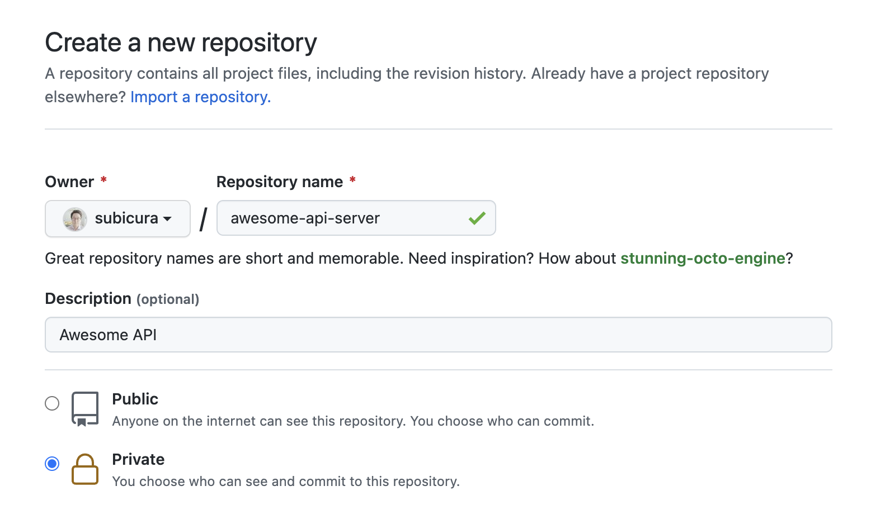
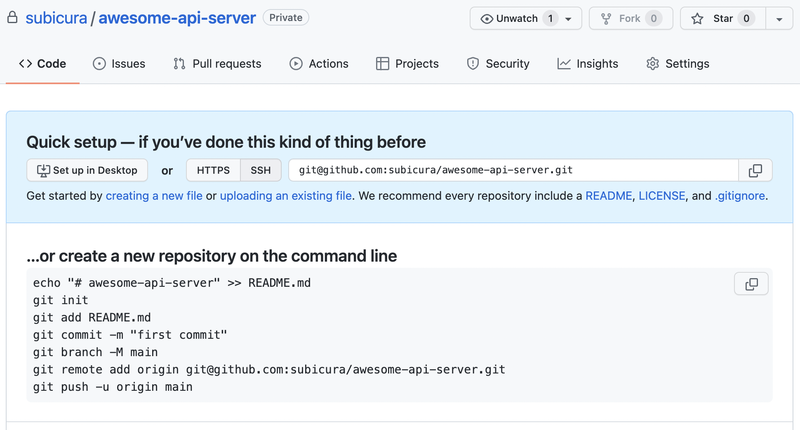
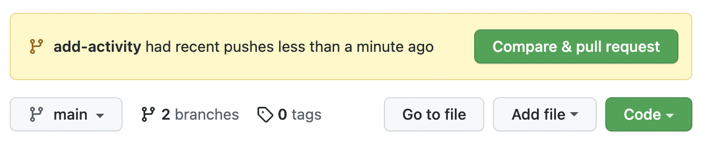
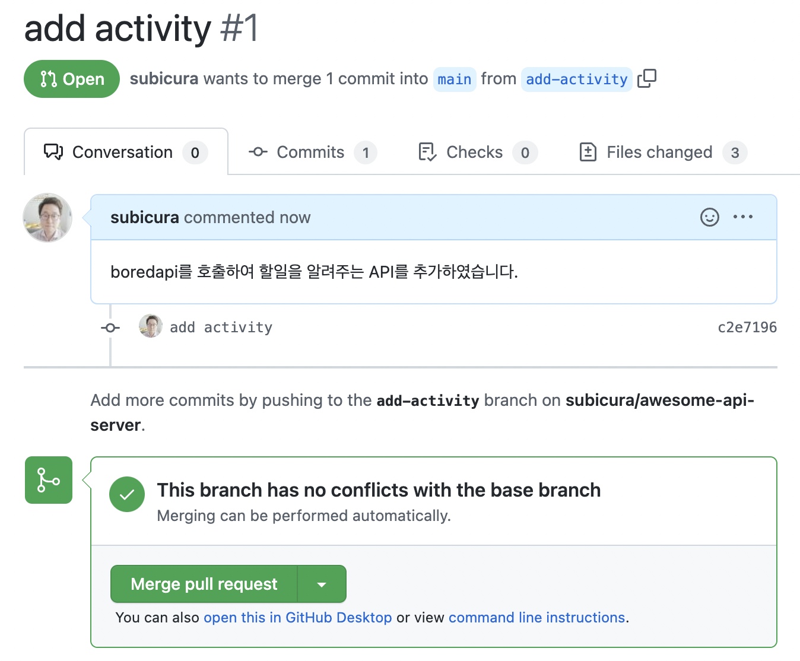

# GitHub

::: tip ⚡️ 목표
✅ [GitHub](https://github.com/)을 이용하여 소스를 공유합니다.  
✅ [GitHub Flow](https://docs.github.com/en/get-started/quickstart/github-flow) 방식을 이용하여 코드를 리뷰합니다.  
✅ Mock을 이용하여 테스트 코드를 작성합니다.
:::

[[toc]]

## 원격 저장소

Git은 단순 버전관리 시스템을 넘어 **분산** 버전 관리 시스템입니다. 분산된 저장소에 소스를 관리할 수 있고 가장 유명한 서비스는 GitHub입니다.

[GitHub에 회원가입](https://subicura.com/git/prepare/github-setup.html)을 하고 첫번째 저장소를 만들어 봅니다. 상단 프로필 이미지 옆에 `+` 버튼을 누르고 `New Repository`를 선택합니다.



저장소 이름을 입력하고 공개 유무를 선택합니다.



🎉 짠! 첫번째 저장소를 만들었습니다.

화면에서 안내하는 대로 원격 저장소를 설정합니다. `git commit` 까지 완료한 상태니, 이후 명령어만 실행합니다.

```sh
git branch -M main
git remote add origin git@github.com:subicura/awesome-api-server.git
git push -u origin main
```

```sh
Enumerating objects: 19, done.
Counting objects: 100% (19/19), done.
Delta compression using up to 8 threads
Compressing objects: 100% (16/16), done.
Writing objects: 100% (19/19), 88.17 KiB | 7.35 MiB/s, done.
Total 19 (delta 4), reused 0 (delta 0), pack-reused 0
remote: Resolving deltas: 100% (4/4), done.
To github.com:subicura/awesome-api-server.git
 * [new branch]      main -> main
Branch 'main' set up to track remote branch 'main' from 'origin'.
```

드디어! 팀원들과 소스를 공유할 수 있는 원격 저장소가 만들어졌습니다.

<Chat-KakaoRoom>
  <Chat-KakaoMsg msg="GitHub 저장소 만들었습니다!" isMe="true" />
  <Chat-KakaoMsg msg="이제 원격으로 코드 공유하려고요 ㅎㅎ" isMe="true" />
  <Chat-KakaoMsg avatar="senior" user="촋 CTO" msg="축하드립니다! 🎉" isMe="false" />
  <Chat-KakaoMsg msg="GitHub 저장소도 만들었으니, 효율적으로 협업하는 방법을 알아볼까요?" isMe="false" />
  <Chat-KakaoMsg msg="아.. 그냥 push, pull 잘하면 되는거 아닌가요?!" isMe="true" />
  <Chat-KakaoMsg avatar="senior" user="촋 CTO" msg="Git은 강력한 브랜치기능을 제공하는데 GitHub Flow 방식으로 개발하면 코드 리뷰와 협업이 편해져요" isMe="false" />
  <Chat-KakaoMsg msg="브런치.. 먹는건가요.." isMe="true" />
  <Chat-KakaoMsg avatar="senior" user="촋 CTO" msg="브런치가 아니고 브랜치(branch)..인데 일단 브랜치 생성부터 알려드릴께요 ㅎㅎㅎ" isMe="false" />
</Chat-KakaoRoom>

## GitHub Flow

Git의 브랜치는 하나의 저장소를 목적에 따라 다양하게 분기할 수 있는 기능입니다. 브랜치 기능을 이용하면 한 작업이 끝나고 다음 작업을 진행한 다음, 그 작업이 끝난 후 그다음 작업을 하는 것이 아니라 동시에 여러 작업을 진행하고 최종적으로 합치는 과정을 자연스럽게 할 수 있습니다.

이번에 새로 추가하는 기능은 외부 API를 호출하고 그 결과를 응답하는 API입니다. 일단 브랜치를 만들어서 분기한 다음 코드를 작성합니다.

```sh
git switch -c add-activity
```

`add-activity` 브랜치를 만들었고 여기에 작성한 코드는 `main` 브랜치에 영향을 미치지 않기 때문에 독립적으로 개발하고 나중에 합치면 됩니다.

외부 API를 호출하기 위해서 `node-fetch` 패키지를 추가합니다.

```
npm install node-fetch@2 --save
```

이제 `src/app.js` 파일에 `/activity` 내용을 추가합니다.

```js
const fetch = require('node-fetch');
...
  app.get("/activity", async function (_, reply) {
    try {
      const response = await fetch("https://www.boredapi.com/api/activity");
      const data = await response.json();
      return { activity: data.activity };
    } catch (e) {
      return reply.code(400).send({ code: "API_ERROR", message: e.message });
    }
  });
...
```

할일 없을 때 할일을 알려주는 `boredapi`를 호출하고 결과를 응답하는 API 입니다. 테스트해볼까요?

```sh
curl http://localhost:3000/activity
```

```sh
{"activity":"Learn to play a new instrument"}
```

잘 동작하네요. 그림 GitHub 저장소에 Push 합니다.

```sh
npm run validate
git add .
git commit -m "add activity"
git push origin add-activity
```

Push하고 GitHub에 접속해볼까요?



`Compare & pull request`를 요청하는 버튼이 보입니다. 브랜치에 작업한 내용을 검토하기 위해 `PR(Pull request)`을 생성합니다.



최종적으로 팀원이 코드 리뷰를 완료하면 `Merge pull request` 버튼을 누릅니다.

<Chat-KakaoRoom>
  <Chat-KakaoMsg avatar="senior" user="촋 CTO" msg="PR 올리신거 리뷰 달았어요" isMe="false" />
  <Chat-KakaoMsg msg="확인해보겠습니다~~" isMe="true" />
  <Chat-KakaoMsg avatar="senior" user="촋 CTO" msg="코드는 깔끔하고 군더더기 없는데, 새로 만든 API 테스트코드가 빠졌더라고요. 추가하면 좋을 것 같아요!" isMe="false" />
  <Chat-KakaoMsg msg="아.. 자꾸 까먹네요 ㅠㅠ 추가하겠습니다" isMe="true" />
</Chat-KakaoRoom>

## Mock 테스트

`/activity`를 호출하면 `{ "activity": "xxx" }`를 호출하는 테스트 코드를 작성합니다.

```js
test('"/activity" 접속시 정상 응답', async () => {
  const app = build();
  const res = await app.inject({
    url: "/activity",
  });

  expect(res.statusCode).toBe(200);
  expect(res.json().activity).toMatchInlineSnapshot();
});
```

Jest가 자동으로 테스트를 수행하고 Snapshot을 생성합니다.

```js
expect(res.json().activity).toMatchInlineSnapshot(
  `"Paint the first thing you see"`
);
```

<Chat-KakaoRoom>
  <Chat-KakaoMsg msg="테스트 코드를 작성하는데 문제가 생겼습니다! ;ㅁ;" isMe="true" />
  <Chat-KakaoMsg avatar="senior" user="촋 CTO" msg="???!!!" isMe="false" />
  <Chat-KakaoMsg msg="외부 API를 호출하는데.. 테스트할때마다 결과가 달라서 테스트가 자꾸 실패하네요 ㅠㅠ" isMe="true" />
  <Chat-KakaoMsg avatar="senior" user="촋 CTO" msg="아.. 외부 API를 사용하는 경우엔 Mock을 이용하면 좋아요" isMe="false" />
  <Chat-KakaoMsg msg="Mock이.. 뭔가요" isMe="true" />
  <Chat-KakaoMsg avatar="senior" user="촋 CTO" msg="외부 API는 제어할 수 없고 응답을 받아서 처리만 가능하죠?" isMe="false" />
  <Chat-KakaoMsg msg="그럼 2가지 정도를 테스트 할 수 있는데, 1) API 서버가 정상적으로 응답을 주었을 때, 2) API 서버에 오류가 있을때 저희가 만든 API가 정상적으로 처리하는지를 보면 될 것 같네요" isMe="false" />
  <Chat-KakaoMsg msg="실제로 외부 API를 호출하지 않고 마치 호출한 것 처럼 하는 방법을 Mock이라고 해요" isMe="false" />
  <Chat-KakaoMsg msg="오.. 대박사건" isMe="true" />
</Chat-KakaoRoom>

외부 API를 호출하는 `fetch`를 Mock으로 변경해서 테스트합니다. 기존 테스트 코드에 다음 내용을 추가합니다.

```js{1,4-5,7-9,12-14}
jest.mock("node-fetch");

const build = require("../app");
const fetch = require("node-fetch");
const { Response } = jest.requireActual("node-fetch");

beforeEach(() => {
  jest.clearAllMocks();
});
...
test('"/activity" 접속시 정상 응답', async () => {
  fetch.mockReturnValue(
    Promise.resolve(new Response(JSON.stringify({ activity: "FAKE_ACTIVITY" })))
  );

  const app = build();
  const res = await app.inject({
    url: "/activity",
  });

  expect(res.statusCode).toBe(200);
  expect(res.json().activity).toMatchInlineSnapshot();
});
```

`fetch`를 호출하면 임의로 `{ activity: "FAKE_ACTIVITY" }`를 응답하도록 테스트 코드를 수정했습니다.

```sh
 PASS  src/__tests__/app.js
  ✓ "/" 요청시 "hello: world" 응답 확인 (33 ms)
  ✓ "/ping" 요청시 "status: ok" 응답 확인 (1 ms)
  ✓ "/activity" 접속시 정상 응답 (1 ms)

Test Suites: 1 passed, 1 total
Tests:       3 passed, 3 total
Snapshots:   3 passed, 3 total
Time:        0.132 s, estimated 1 s
Ran all test suites related to changed files.

Watch Usage: Press w to show more.
```

🎉 성공! 경고 없이 실행되었습니다. 여러번 실행해도 매번 성공합니다. API 요청도 줄이고 속도도 빠르고 1석 2조?

이제, 외부 API 서버에 오류가 생겼을 때 테스트 코드를 작성합니다.

```js
test('"/activity" 접속시 boredapi 오류 처리', async () => {
  fetch.mockReturnValue(Promise.reject("API is down"));

  const app = build();
  const res = await app.inject({
    url: "/activity",
  });

  expect(res.statusCode).toBe(400);
  expect(res.json().code).toEqual("API_ERROR");
});
```

Jest가 자동으로 테스트를 수행합니다.

```sh
 PASS  src/__tests__/app.js
  ✓ "/" 요청시 "hello: world" 응답 확인 (37 ms)
  ✓ "/ping" 요청시 "status: ok" 응답 확인 (2 ms)
  ✓ "/activity" 접속시 정상 응답 (1 ms)
  ✓ "/activity" 접속시 boredapi 오류 처리 (1 ms)

Test Suites: 1 passed, 1 total
Tests:       4 passed, 4 total
Snapshots:   3 passed, 3 total
Time:        0.184 s, estimated 1 s
Ran all test suites related to changed files.

Watch Usage: Press w to show more.
```

역시 성공입니다.

곰곰이 생각해보니 외부 API 응답은 정상인데 `activity`값이 비어 있는 경우도 처리를 해야할 것 같습니다. 관련해서 테스트 코드를 추가합니다.

```js{3}
test('"/activity" 접속시 activity 빈값 처리', async () => {
  fetch.mockReturnValue(
    Promise.resolve(new Response(JSON.stringify({ activity: "" })))
  );

  const app = build();
  const res = await app.inject({
    url: "/activity",
  });

  expect(res.statusCode).toBe(400);
  expect(res.json().code).toEqual("API_ERROR");
});
```

테스트 결과는 실패입니다. 오류가 발생하길 기대했는데 정상적으로 `200`을 응답하네요.

```sh
  ● "/activity" 접속시 activity 빈값 처리

    expect(received).toBe(expected) // Object.is equality

    Expected: 400
    Received: 200

      69 |   });
      70 |
    > 71 |   expect(res.statusCode).toBe(400);
         |                          ^
      72 |   expect(res.json().code).toEqual("API_ERROR");
      73 | });

      at Object.<anonymous> (src/__tests__/app.js:71:26)
```

`app.js` 코드를 수정합니다.

```js{5-11}
app.get("/activity", async function(_, reply) {
  try {
    const response = await fetch("https://www.boredapi.com/api/activity");
    const data = await response.json();
    if (data && data.activity) {
      return { activity: data.activity };
    } else {
      return reply
        .code(400)
        .send({ code: "API_ERROR", message: "Activity is required!" });
    }
  } catch (e) {
    return reply.code(400).send({ code: "API_ERROR", message: e.message });
  }
});
```

🎉 모두 성공입니다! ~~짜릿해, 늘 새로워, 테스트코드가 최고야~~

이제 작성한 코드를 Push 합니다. 동일한 브랜치에 커밋을 추가하면 GitHub PR에 자동으로 반영됩니다.

```sh
npm run validate
git add .
git commit -m "add activity test code"
git push origin add-activity
```

GitHub에서 `Merge pull request` 버튼을 눌러 코드를 합칩니다.

최종적으로 `main` 브랜치로 이동하고 최신 소스를 가져옵니다.

```sh
git switch main
git pull
```

## 마무리

GitHub Flow를 이용하면 효율적으로 코드를 검토하고 협업할 수 있습니다. 정적 코드 분석과 포멧터를 이용하여 코드 스타일에 대한 리뷰를 최대한 줄이고 핵심 로직을 검토할 수 있도록 합니다.

테스트와 관련해선 이번 글이 마지막입니다. 더 자세한 내용은 너무 범위가 넓어져서.. 테스트 관련해서 알아두면 좋은건 `Mock`이 많으면 좋지 않은 테스트 코드의 징조라는 겁니다. 실제 테스트 코드를 작성할 땐, 테스트 전문 서적/글을 꼭 참고해 주세요.
